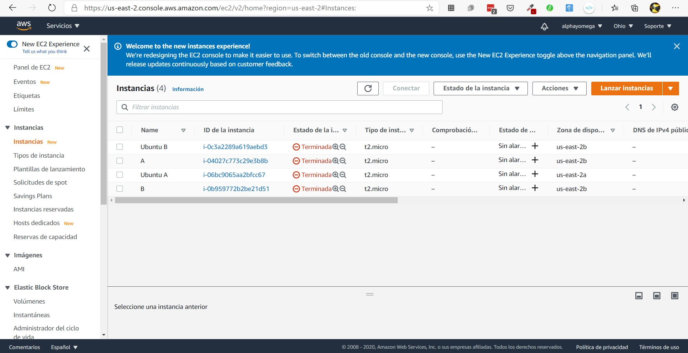

# Practica1_redes
 Creación de una pagina Web  utilizando tecnologia en la nube(ec2 y Segurity Groups)

 ## Creación de EC2

_Debemos de ingresar a la consola de aws e ir al apartado de EC2._

_Seleccionamos la opción lanzar instancia y realizamos las configuraciones necesarias._

* **Versión de Sistema** - *Ubuntu 18*
* **Tipo de instancia** - *t2-micro* 
* **VPC** - *dejamos la que default* 
* **Almacenamiento** - *8GiB SSD*

_Nos detenemos un momento en la sección **Segurity Groups**, le asignamos un nombre y creamos uno que permita el trafico ssh solo para nuestra IP y el trafico HTTP para el público en general de la siguiente manera_

