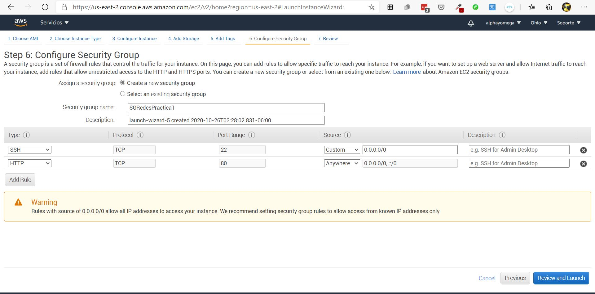

# Practica1_redes
 Creación de una pagina Web  utilizando tecnologia en la nube(ec2 y Segurity Groups)


 ## Creación de EC2

_Debemos de ingresar a la consola de aws e ir al apartado de EC2._


_Seleccionamos la opción lanzar instancia y realizamos las configuraciones necesarias._


* **Versión de Sistema** - *Ubuntu 18*
* **Tipo de instancia** - *t2-micro* 
* **VPC** - *dejamos la default* 
* **Almacenamiento** - *8GiB SSD*


_Nos detenemos un momento en la sección **Segurity Groups**, le asignamos un nombre y creamos uno que permita el trafico ssh solo para nuestra IP y el trafico HTTP para el público en general de la siguiente manera_



_Revisamos la configuración y le damos lanzar_


_Cuando la instancia este creada nos podremos conectar mediante ssh, una vez dentro instalamos apache_

## Instalación Apache 🔧

### Paso 1-Instalacion 🔧
_Empezaremos por actualizar el índice de los paquetes locales. Esto, para garantizar que en él se refleje las cargas más recientes de las nuevas versiones de los paquetes._

```
$ sudo apt update
```

_A continuación, instala el paquete apache2:_

```
sudo apt install apache2
```
### Paso 2-Configuración cortafuegos 🔧
_Lista los perfiles de aplicación dentro ufw digitando:_

```
$ sudo ufw app list
```

_Se debería desplegar una lista de perfiles de aplicación:_

```
Available applications:
  Apache
  Apache Full
  Apache Secure
  OpenSSH
```

_Permitiremos el tráfico a través del puerto 80:_
```
$ sudo ufw allow 'Apache'
```
_Se puede verificar el cambio digitando:_
```
$ sudo ufw status
```

_Se te debería desplegar que el tráfico HTTP se encuentra permitido:_
```
Status: active

To                         Action      From
--                         ------      ----
OpenSSH                    ALLOW       Anywhere                  
Apache                     ALLOW       Anywhere                  
OpenSSH (v6)               ALLOW       Anywhere (v6)             
Apache (v6)                ALLOW       Anywhere (v6)
```

### Paso 3-Verificar el servicio web 🔧
_Verifica con el sistema de base systemd que el servicio se está ejecutando al digitar:_

```
$ sudo systemctl status apache2
```

_La salida debería ser la siguiente:_

```
● apache2.service - The Apache HTTP Server
   Loaded: loaded (/lib/systemd/system/apache2.service; enabled; vendor preset: enabled)
  Drop-In: /lib/systemd/system/apache2.service.d
           └─apache2-systemd.conf
   Active: active (running) since Tue 2018-04-24 20:14:39 UTC; 9min ago
 Main PID: 2583 (apache2)
    Tasks: 55 (limit: 1153)
   CGroup: /system.slice/apache2.service
           ├─2583 /usr/sbin/apache2 -k start
           ├─585 /usr/sbin/apache2 -k start
           └─2586 /usr/sbin/apache2 -k start
```
_**Listo ya tendremos instalado Apache**, solo queda reemplazar la pagina por defecto que se ubica en /var/www/html_

_Para cambiar la vista principal seguimos los pasos del siguiente video_


* [VIDEO](https://www.youtube.com/watch?v=nM8Y0UPDXMM) - Pasos para cambiar la vista principal de apache

**Este procedimiento se repite para la segunda maquina virtual o EC2**


_La dirección para visitar el sitio web es:_


* [EC1](ec2-3-131-137-81.us-east-2.compute.amazonaws.com) - Maquina virtual 1

* [EC2](ec2-3-138-157-39.us-east-2.compute.amazonaws.com) - Maquina virtual 2

## Creacion de balanceador de carga

_Debemos de ingresar a la consola de aws e ir al apartado de EC2->Equilibrio de carga->Balanceadores de carga_


_Seleccionamos la opción Create Load Balancer y realizamos las configuraciones necesarias._

* **Tipo de balanceador** - *HTTP/HTTPS*
* **Esquema** - *internet-facing* 
* **VPC** - *dejamos la que tiene por default, y elejimos las subredes correspondientes* 
* **Grupo de seguridad** - *El que creamos anteriormente*
* **Tipo de target** - *Por instancia*

_Agregamos las instancias creadas anteriormente a nuestro balanceador y le damos en crear_


_Esperemos un momento a que aws lo configure y podremos utilizarlo_


* [Sitio Web](http://loadbalancerredes-1475332818.us-east-2.elb.amazonaws.com/) - Sitio Principal,usando balanceador